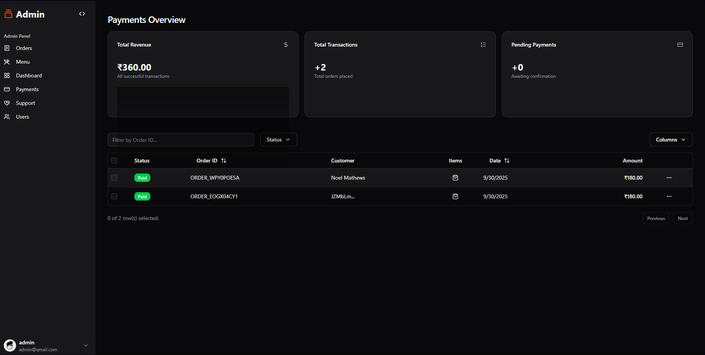

# 🍕 Gitzzeria-Revamped - Modern Canteen Management System

<p align="center">
  
</p>

**Gitzzeria** is a full-stack, real-time canteen management platform designed to revolutionize the campus dining experience. Built with a focus on speed, security, and user-centric design, Gitzzeria provides a seamless digital interface for both students and administrators. Users can browse a live menu, place orders, and receive real-time status updates, while admins get a powerful dashboard to manage operations, from order fulfillment to analytics.

This project was built from the ground up, migrating from an older architecture to a modern, scalable stack using **React (Vite), TypeScript, Firebase, and ShadCN UI**.

---

## ✨ Core Features

### For Users 🧑‍🎓
* **Secure Authentication:** Robust email/password signup with mandatory **email verification** and a secure password reset flow.
* **Dynamic & Animated Menu:** A fully responsive menu with live search and fluid animations powered by **Framer Motion**.
* **Seamless Ordering:** An interactive cart system for adding, modifying, and managing items before checkout.
* **Real-Time Order Tracking:** The "My Orders" page updates live, showing order statuses as `'Pending'`, `'Ready'`, or `'Cancelled'`.
* **In-App Notifications:** A global notification system alerts users in real-time when their order is ready or has been cancelled by an admin.
* **Two-Way Support System:** A complete messaging interface for users to submit queries about past orders and receive direct replies from admins.
* **Account Management:** A dedicated page for users to view their profile and update their name.

### For Admins ⚙️
* **Role-Based Access Control:** A separate, secure login for administrators, protected by Firebase rules.
* **Comprehensive Order Dashboard:** A real-time view of all incoming orders, with actions to mark them as "Ready" or "Cancel".
* **Full Menu Management (CRUD):** A dedicated interface to **C**reate, **R**ead, **U**pdate, and **D**elete menu items.
* **Advanced Payments Table:** A sophisticated data table built with **TanStack Table** to view all transactions, featuring sorting, filtering by status, and an "Items" tooltip.
* **User Management:** A dashboard to view all registered users and manage their admin permissions.
* **Live Analytics Dashboard:** Visual charts built with **Recharts** displaying key metrics like sales trends, order status breakdowns, and most popular items.
* **Interactive Support Panel:** A complete two-way messaging system to reply to user queries and manage ticket statuses ("Open"/"Resolved").

---

## 📸 Screenshots

<p align="center">
  <strong>Login & Signup</strong><br>
  
</p>
<p align="center">
  <strong>User Menu Page</strong><br>
  
</p>
<p align="center">
  <strong>Shopping Cart</strong><br>
  
</p>
<p align="center">
  <strong>User's Order Status</strong><br>
  
</p>
<p align="center">
  <strong>User Support Page (Two-Way Chat)</strong><br>
  
</p>
<p align="center">
  <strong>Admin Login</strong><br>
  
</p>
<p align="center">
  <strong>Admin Order Management</strong><br>
  
</p>
<p align="center">
  <strong>Admin Menu Management (CRUD)</strong><br>
  
</p>
<p align="center">
  <strong>Admin Payments Table</strong><br>
  
</p>
<p align="center">
  <strong>Admin Analytics Dashboard</strong><br>
  
</p>

---

## 🧰 Tech Stack & Libraries

* **Framework:** [React (Vite)](https://vitejs.dev/) + [TypeScript](https://www.typescriptlang.org/)
* **Backend & Database:** [Firebase](https://firebase.google.com/) (Authentication, Firestore Realtime Database)
* **Styling:** [Tailwind CSS](https://tailwindcss.com/)
* **UI Components:** [ShadCN UI](https://ui.shadcn.com/)
* **Data Tables:** [TanStack Table](https://tanstack.com/table/v8)
* **Charts & Analytics:** [Recharts](https://recharts.org/)
* **Animations:** [Framer Motion](https://www.framer.com/motion/)
* **Routing:** [React Router](https://reactrouter.com/)
* **Notifications:** [Sonner (React Toast)](https://sonner.emilkowal.ski/)

---

## 🚀 Getting Started

To get a local copy up and running, follow these simple steps.

### Prerequisites
* Node.js (v18 or higher)
* A Firebase project with Firestore and Authentication enabled.

### Installation
1.  **Clone the repository:**
    ```sh
    git clone https://github.com/Noel9812/Gitzzeria-Revamped.git
    ```
2.  **Navigate to the project directory:**
    ```sh
    cd Gitzzeriaa-Revamped
    ```
3.  **Install NPM packages:**
    ```sh
    npm install
    ```
4.  **Set up your environment variables:**
    * Create a `.env` file in the root of the project.
    * Add your Firebase project configuration keys to this file:
        ```
        VITE_FIREBASE_API_KEY=your_api_key
        VITE_FIREBASE_AUTH_DOMAIN=your_auth_domain
        VITE_FIREBASE_PROJECT_ID=your_project_id
        VITE_FIREBASE_STORAGE_BUCKET=your_storage_bucket
        VITE_FIREBASE_MESSAGING_SENDER_ID=your_sender_id
        VITE_FIREBASE_APP_ID=your_app_id
        ```
5.  **Start the development server:**
    ```sh
    npm run dev
    ```
---

## 🤝 Contributing

Contributions are what make the open-source community such an amazing place to learn, inspire, and create. Any contributions you make are **greatly appreciated**.
mail us at noelmathews123@gmail.com for any project related matters.🤝

If you have a suggestion that would make this better, please fork the repo and create a pull request. You can also simply open an issue with the tag "enhancement".
1.  Fork the Project
2.  Create your Feature Branch (`git checkout -b feature/AmazingFeature`)
3.  Commit your Changes (`git commit -m 'Add some AmazingFeature'`)
4.  Push to the Branch (`git push origin feature/AmazingFeature`)
5.  Open a Pull Request

---

## 🪪 License

Distributed under the MIT License. See `LICENSE` for more information.
